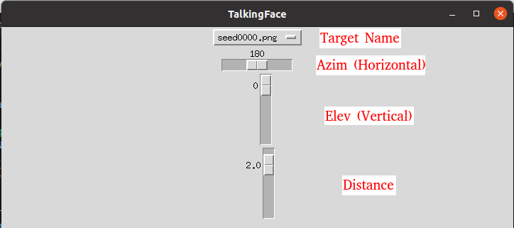
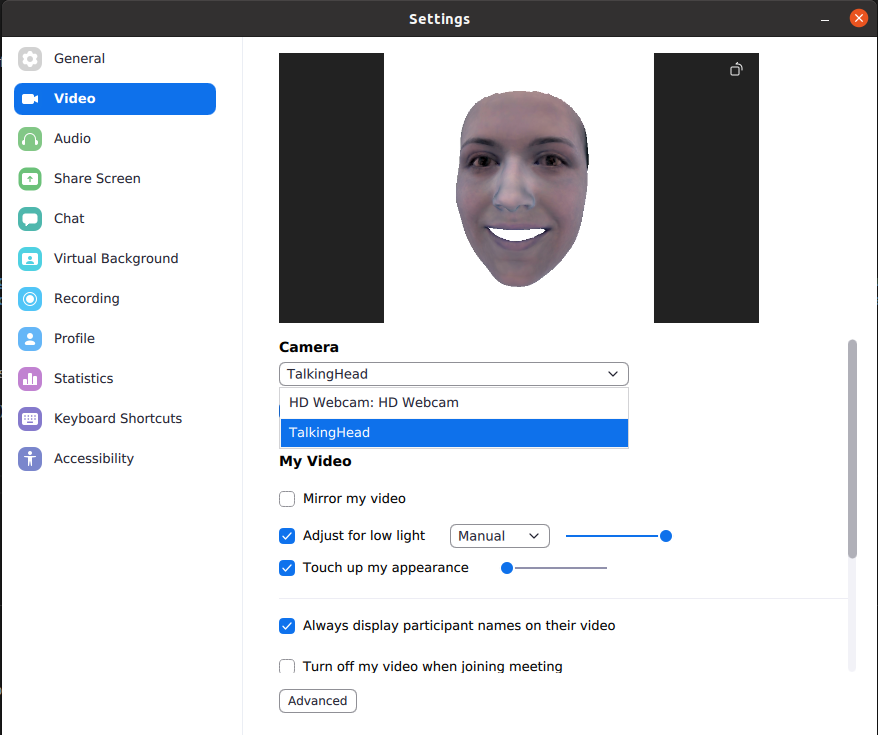
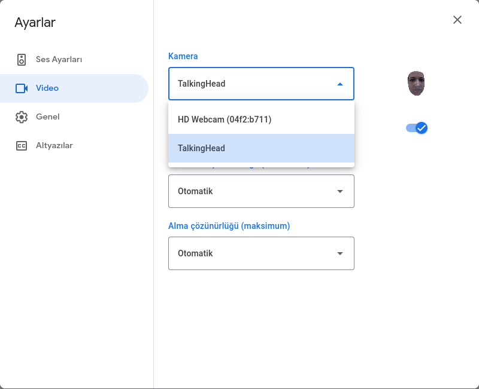

# 3D TalkingFace
The code base of this repository was developed using the [Deep3DFaceRecon_pytorch](https://github.com/sicxu/Deep3DFaceRecon_pytorch) repository.

<p align="center"> 
    
</p>

**3DTalkingFace** for video calls.

**3DTalkingFace** is a project that can be used during video calls, reconstructing the face you specified in 3D and making it talk to the face in the image taken from the webcam.

# Installation
**3DTalkingFace** requires manually installation for some additional stuffs like [nvdiffrast](https://nvlabs.github.io/nvdiffrast/) and [insightface](https://github.com/deepinsight/insightface). Additional installation information can be found in the [Deep3DFaceRecon_pytorch](https://github.com/sicxu/Deep3DFaceRecon_pytorch) repository.


## Build Dockerfile
```
docker build -t talkingface .
```

## Inference
```
bash run.sh
```

## Important!
### **Since I am working on face detection in another project, I cannot share it at the moment, but you can easily implement your own face detection network and make the system usable with only 5 landmark outputs. In the `main.py` file, detection initialization and inference parts are specified as #TODO on lines 62 and 121.**

# Usage
Target and camera angles can be adjusted from the menu that created with `tkinter`.

<p align="center"> 
    
</p>

## Zoom and Google Meet
After the system is running with the `bash run.sh` command, the camera will open and the rendered face will be displayed. Then the zoom application will be opened and `TalkingHead` will be selected as the camera from the settings. The same process can be used for Google Meet as well.

<p align="center"> 
    
</p>
<p align="center"> 
    
</p>